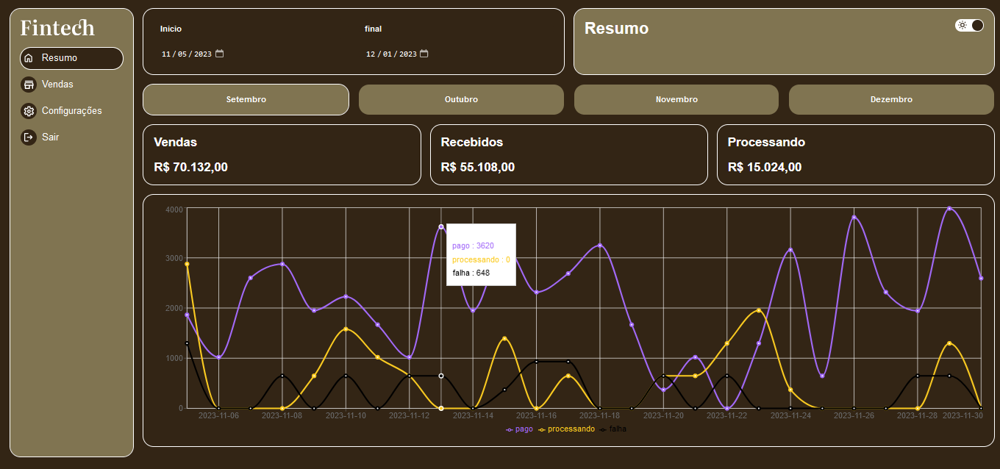

# Fintech



> Projeto de uma fintech criado para estudar sobre o uso de React + typescript de quebra foi implementado funcionalidades como troca de tema e este projeto para aprofundar os estudos sobre o hook useContext do React js, além do uso do React-router-dom

## 💻 Pré-requisitos

Antes de começar, verifique se você atendeu aos seguintes requisitos:

* Ter instalado a versão mais recente do Node js;
* Instalar dependências
  ```
  npm i
  ```
* Rodar projeto
  ```
  npm run dev
  ```

## ☕ Onde acessar

Você pode acessar o portfolio através desse link:

[fintech](https://fintech-sigma-coral.vercel.app/)

## 🤝 Colaboradores

<table>
  <tr>
    <td align="center">
      <a href="#">
        <br>
        <sub>
          <b>Neto Sousa</b>
        </sub>
      </a>
    </td>
  </tr>
</table>

## 🛠️ Tecnologias

* [Next Js](https://nextjs.org/)
* [React Js](https://react.dev/)
* [Typescript](https://www.typescriptlang.org/)
* [React-router-dom](https://reactrouter.com/en/main)

## 📝 Licença

Esse projeto está sob licença. Veja o arquivo [LICENÇA](LICENSE.md) para mais detalhes.
